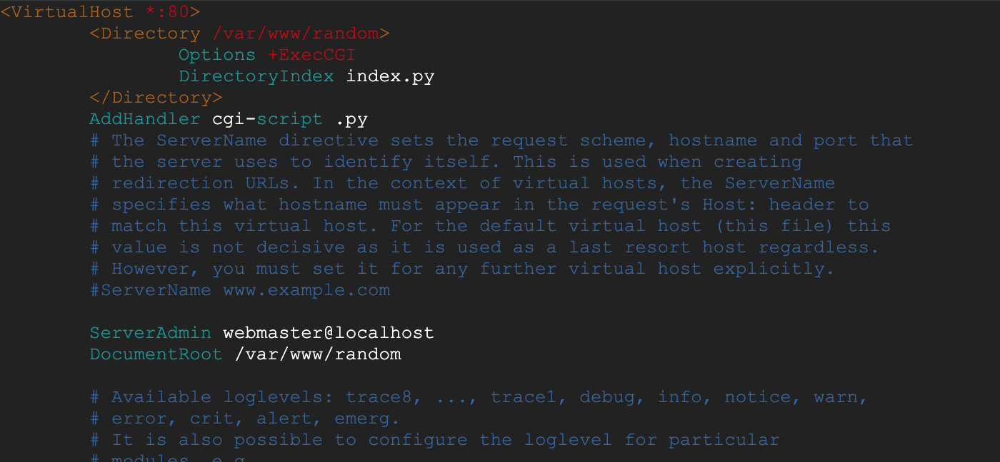

# Random Number Generator Compute Engine for Python 

Demo: http://35.202.0.25/

Apache2 will be used as the web server for the python compute enigne. 

# Tutorial
## Install Apache2 
> sudo apt-get install apache2 -y 

## Create Random Number Page 
By default the root directory of the website is stored in var/www/html. Create a new directory for the random number page that we will create. 
> sudo mkdir var/www/random

Place 'index.py' in directory. This is a simple python file that displays a random number on the page.  

Make 'index.py' executable.
> sudo chmod 755 var/www/random/index.py

## Edit Apache's Config File 
Open apache config file
> sudo vim /etc/apache2/sites-enabled/000-default.conf

Add the following under the first line 
<pre><code>&lt;Directory /var/www/test&gt;
    Options +ExecCGI 
    DirectoryIndex index.py 
&lt;/Directory&gt;
</code></pre> 

Edit the line that reads 'DocumentRoot /var/www/html'. Modify it so it reads:
> DocumentRoot /var/www/random

The contents of the file should now read as:  

The file should now match 'apache_config.config.' 

## Restart Apache and Visit Page
Restart apache so that the updates to the config file take effect.
> sudo service apache2 restart

To visit the random number generator site visit http//:[YOUR_EXTERNAL_IP]. To find your exteranl ip address on a Linux machine type:
> curl ifconfig.me

